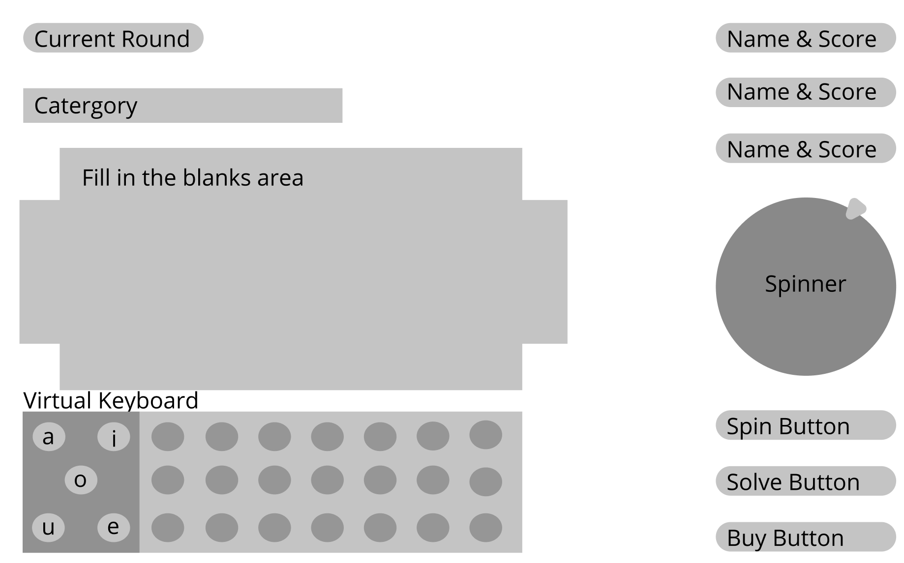
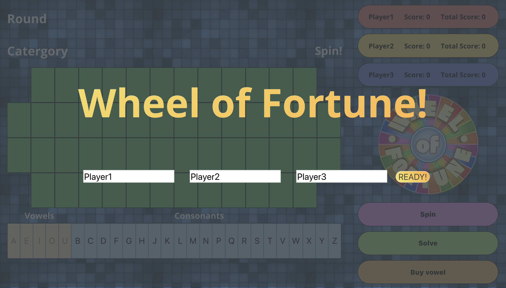

# Wheel of Fortune!

Try out our recreation of the classic game show, Wheel of fortune! This game consist of 4 rounds and 3 players, spin the wheel and solve the answer! [Try out today](https://ellytea.github.io/wheel-of-fortune/)

## Original Wireframe

## V.1.0 layout

## About
The goal for this project is to show our understanding of Object Oriented Programming, and using Test Driven Developement.

## Specs 
* Built with jQuery
* Testing with Mocha/Chai

## Next Steps
[Issues](https://github.com/ellytea/wheel-of-fortune/issues)

## Setup
clone down repo

## Turing D.T.R
[DTR](https://gist.github.com/ellytea/94cd7c9af31a75f6477eea0835bc0c1e)
